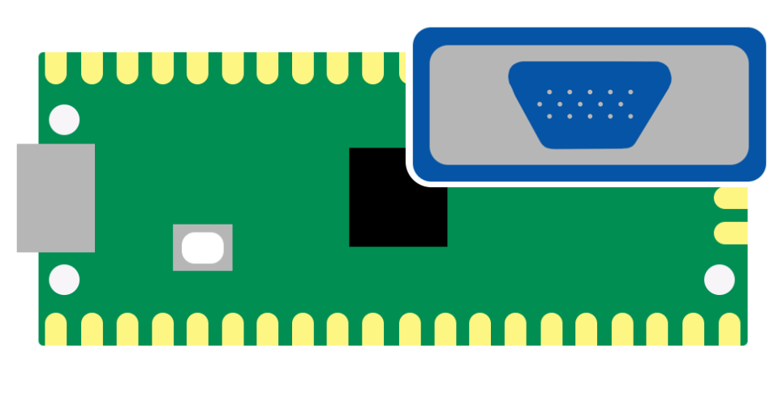

# Pico-VGA: A micro controller video card

A VGA Driver made from a Raspberry Pi Pico with the eventual goal of being an acting video card.

I also plan to experiment with 3D rendering on it.

## PCB
Kicad and fabrication files can be found in `kicad/`

## Contributors
- [Alexandre Rouma](https://github.com/AlexandreRouma) (Logo Design)
- [Joshua Webster](https://github.com/w3bb0) (PCB Design)
